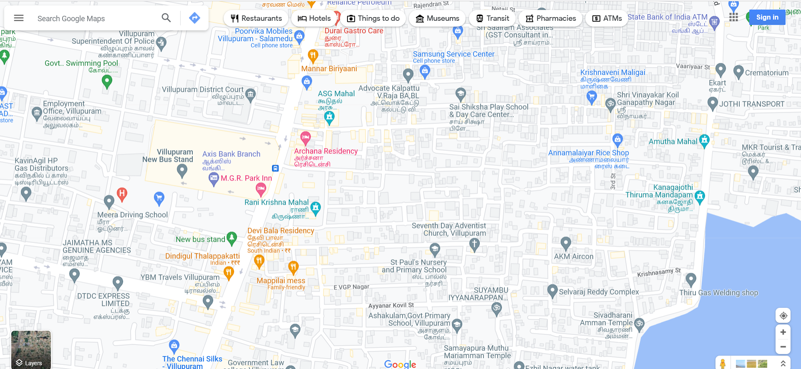
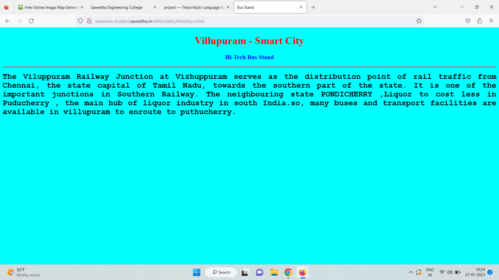
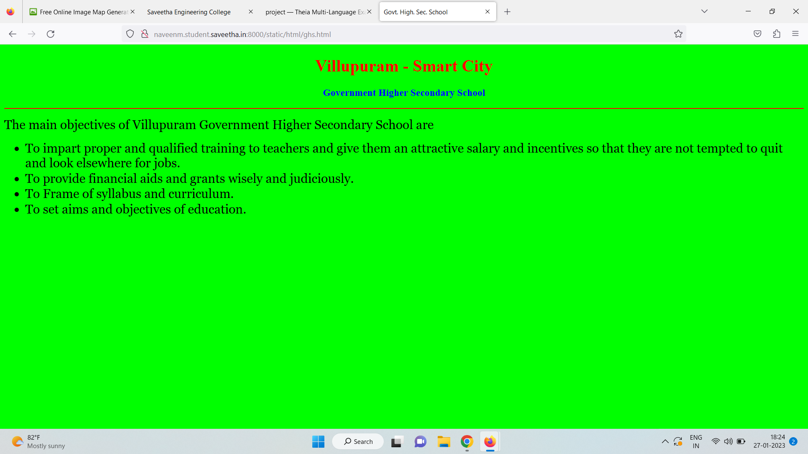
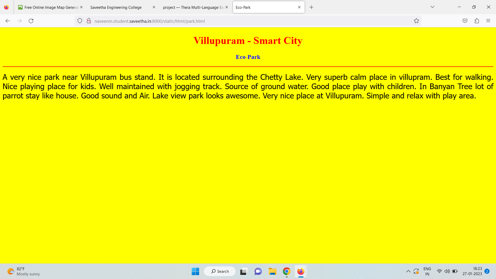
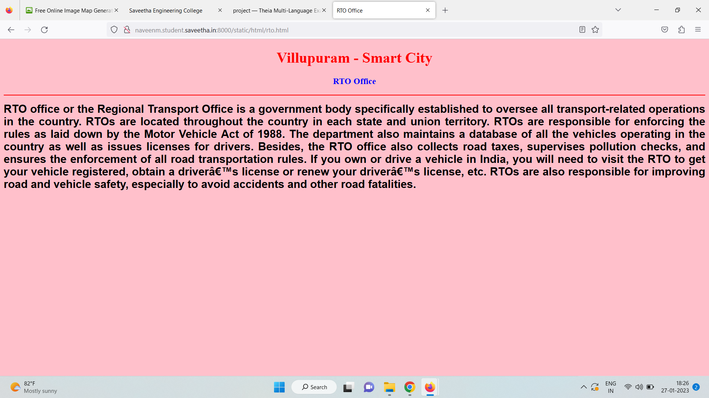
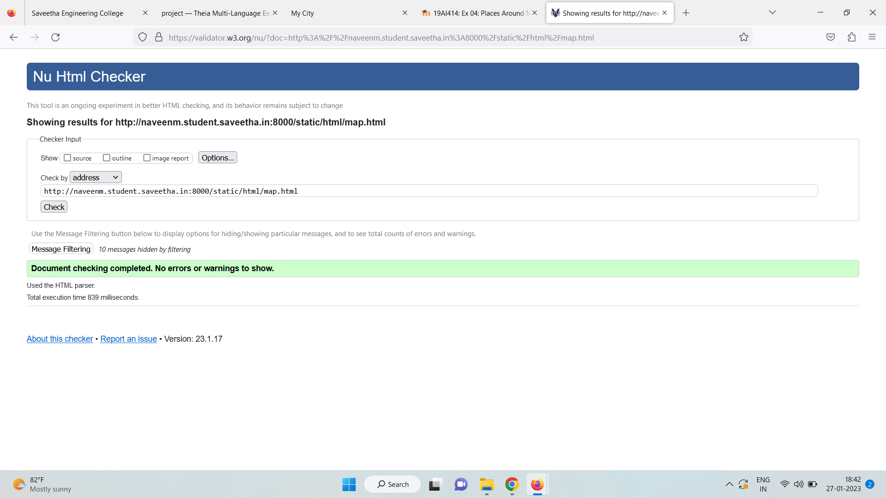

# Places Around Me
## AIM:
To develop a website to display details about the places around my house.

## Design Steps:

### Step 1:
Clone the repository into Theia IDE.


### Step 2:
Create a new Django project.

### Step 3:
write  the needed HTML code.

### Step 4:
Run the Django server and and execute  the HTML files.

## Code:
```
map.html

<!DOCTYPE html>
<html lang="en">
<head>
<title>My City</title>
</head>
<body>
<h1 align="center">
<font color="red"><b>Villupuram- Smart City</b></font>
</h1>
<h3 align="center">
<font color="blue"><b>Naveen Kumar M (22009110)</b></font>
</h3>
<center>

<map name="MyCity">
<!-- Image Map Generated by http://www.image-map.net/ -->


<map name="image-map">
    <area target="_self" alt="bustand" title="bustand" href="bus.html" coords="348,251,712,529" shape="rect">
    <area target="_self" alt="lake" title="lake" href="lake.html" coords="1565,833,1900,580" shape="rect">
    <area target="_self" alt="park" title="park" href="park.html" coords="84,245,2,55" shape="rect">
    <area target="_self" alt="rto" title="rto" href="rto.html" coords="219,87,438,172" shape="rect">
    <area target="_self" alt="gh" title="gh" href="ghs.html" coords="763,38,1029,127" shape="rect">
    <area target="_self" alt="vk" title="vk" href="vk.html" coords="1333,109,1683,267" shape="rect">
</map>
</map>
</center>
</body>
</html>

bus.html
<!DOCTYPE html>
<html lang="en">
<head>
<title>Bus Stand</title>
</head>
<body bgcolor="cyan">
<h1 align="center">
<font color="red"><b>Villupuram - Smart City</b></font>
</h1>
<h3 align="center">
<font color="blue"><b>Hi-Tech Bus Stand</b></font>
</h3>
<hr size="3" color="red">
<p align="justify">
<font face="Courier New" size="5">
<b>
The Viluppuram Railway Junction at Vizhuppuram serves as the distribution point
of rail traffic from Chennai, the state capital of Tamil Nadu, towards the southern
part of the state. It is one of the important junctions in Southern Railway.
The neighbouring state PONDICHERRY ,Liquor to cost less in Puducherry , 
the main hub of liquor industry in south India.so, many buses and transport 
facilities are available in villupuram to enroute to puthucherry.
</b>
</font>
</p>
</body>
</html>

ghs.html
<!DOCTYPE html>
<html lang="en">
<head>
<title>Govt. High. Sec. School</title>
</head>
<body bgcolor="lime">
<h1 align="center">
<font color="red"><b>Villupuram - Smart City</b></font>
</h1>
<h3 align="center">
<font color="blue"><b>Government Higher Secondary School</b></font>
</h3>
<hr size="3" color="red">
<p align="justify">
<font face="Georgia" size="5">
The main objectives of Villupuram Government Higher Secondary School are 
<ul>
<li>To impart proper and qualified training to teachers and give them an attractive salary and incentives so that they are not tempted to quit and look elsewhere for jobs.</li>
<li>To provide financial aids and grants wisely and judiciously.</li>
<li>To Frame of syllabus and curriculum.</li>
<li>To set aims and objectives of education.</li>
</ul>
</font>
</p>
</body>
</html>

park.html
<!DOCTYPE html>
<html lang="en">
<head>
<title>Eco-Park</title>
</head>
<body bgcolor="yellow">
<h1 align="center">
<font color="red"><b>Villupuram - Smart City</b></font>
</h1>
<h3 align="center">
<font color="blue"><b>Eco-Park</b></font>
</h3>
<hr size="3" color="red">
<p align="justify">
<font face="Tahoma" size="5">
A very nice park near Villupuram bus stand. It is located surrounding the Chetty Lake. 
Very superb calm place in villupram. Best for walking. Nice playing place for kids.
Well maintained with jogging track. Source of ground water.
Good place play with children.  In Banyan Tree lot of parrot stay like house. 
Good sound and Air. Lake view park looks awesome.
Very nice place at Villupuram.
Simple and relax with play area.
</font>
</p>
</body>
</html>

rto.html
<!DOCTYPE html>
<html lang="en">
<head>
<title>RTO Office</title>
</head>
<body bgcolor="pink">
<h1 align="center">
<font color="red"><b>Villupuram - Smart City</b></font>
</h1>
<h3 align="center">
<font color="blue"><b>RTO Office</b></font>
</h3>
<hr size="3" color="red">
<p align="justify">
<font face="Arial" size="5">
<b>
RTO office or the Regional Transport Office is a government body specifically established to oversee all transport-related operations in the country. RTOs are located throughout the country in each state and union territory. RTOs are responsible for enforcing the rules as laid down by the Motor Vehicle Act of 1988.
The department also maintains a database of all the vehicles operating in the country as well as issues licenses for drivers. Besides, the RTO office also collects road taxes, supervises pollution checks, and ensures the enforcement of all road transportation rules. If you own or drive a vehicle in India, you will need to visit the RTO to get your vehicle registered, obtain a driver’s license or renew your driver’s license, etc.
RTOs are also responsible for improving road and vehicle safety, especially to avoid accidents and other road fatalities.
</b>
</font>
</p>
</body>
</html>

vk.html
<!DOCTYPE html>
<html lang="en">
<head>
<title>Marudur Lake</title>
</head>
<body bgcolor="orange">
<h1 align="center">
<font color="red"><b>Villupuram - Smart City</b></font>
</h1>
<h3 align="center">
<font color="blue"><b>MarudurLake</b></font>
</h3>
<hr size="3" color="red">
<p align="justify">
<font face="Georgia" size="5">
The uses of Marudur Lake in Villupuram District are 
<ol type="1">
<li>Lake is used for rain water harvesting.</li>
<li>It is used for drinking.</li>
<li>Pisculture.</li>
<li>For bathing, washing clothes etc.</li>
</ol>
</font>
</p>
</body>
</html>
```

## Output:












## HTML Validator:


## Result:
The program for imlementing image map is executed successfully